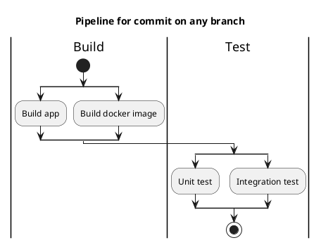
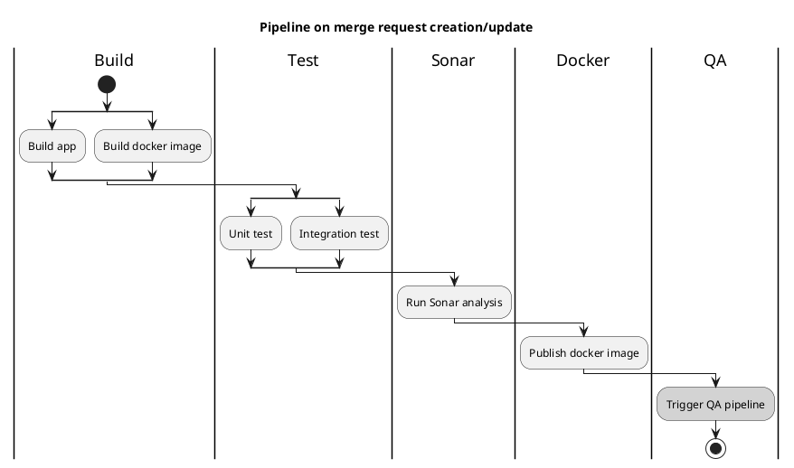
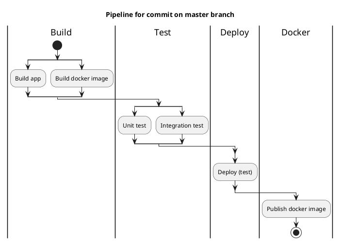

# CI Pipeline

## Diagram legend

```text
yellow block - automatic action
grey block - manual actions
```

## Pipeline for commit on any branch



## Pipeline on merge request creation/update



## Pipeline for commit on master branch


