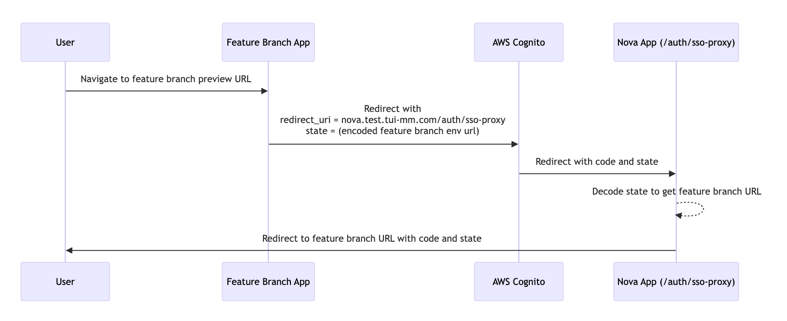

# SSO Proxy

## Introduction

Feature Branch Preview Environment is temporary instances of the application with unique URLs based on the feature branch name or some random string (e.g., https://<feature-branch-name>.baseurl.com. Integrating these URLs with AWS Cognito presents challenges because Cognito requires exact redirect_uri values, and wildcarding is not supported for security reasons. So we can't use the feature branch url as the redirect_uri because the url will be random for each feature branch.

## Solution Overview

The SSO Proxy uses the state parameter during the OAuth2 login process to manage where users are redirected after they log in. It encodes the url information in the state so that it can send users to the correct feature branch URL after authentication.

## How it works

1. The user initiates the authentication process by navigating to the feature branch preview environment url.

2. The application redirects the user to AWS Cognito for authentication but uses the SSO Proxy url(`https://nova.test.tui-mm.com/auth/sso-proxy`) as the redirect_uri. So we don't use the feature branch url as the redirect_uri.

3. After successful authentication, Cognito redirects the user back to the SSO Proxy with an authorization code to the `https://nova.test.tui-mm.com/auth/sso-proxy` url. With the `code` and `state` query parameters. `/auth/sso-proxy?code=xxx&state=xxx`.

4. The state param contains the feature branch url (its base64 encoded). So the SSO Proxy page decodes the state parameter to get the feature branch url.

5. The SSO Proxy page redirects the user to the feature branch URL. With the `code` and `state` query parameters. `https://<feature-branch-name>.baseurl.com/?code=xxx&state=xxx`.

6. The feature branch page can now use the `code` to get the access token. And checks the `state` param to make sure the request is from the same feature branch for security reasons.

## Additional Information

### Callback URL Configuration:

we need to add the `https://<APP_BASE_URL>/en/sso-proxy` url as a Callback URL in the AWS Cognito pool configuration.

## Security

The `state` parameter includes a random string to protect against CSRF attacks. Same as other environments (test, pre, prod etc.). this is not related to the SSO Proxy. Its handled by the auth library automatically.

## Workarounds

### Preview Environment

We are using the preview env url as sso-proxy url.
so instead of `https://nova.test.tui-mm.com/en/sso-proxy` we are using `https://nova-dx-offer-content-39d504029f02f2225b9dbcdf673217df17797b8ef.pages.devops.tui`
Since the preview env is already configured to work with Cognito. We replace the index page with the SSO Proxy page for now.

There is a task to refactor workarounds: https://jira.tuigroup.com/browse/OFF-3664

## Resources:

- aws docs: https://docs.aws.amazon.com/cognito/latest/developerguide/authorization-endpoint.html
- flow image on mermaid:
[link](https://mermaid.live/edit#pako:eNptkl9rwjAUxb_KJU8bWH0vs-AmexpuWGQvhXFNr22YTbr8qRPxuy9Zqrh2fShNcs65vx5yYlyVxFJm6MuR5LQUWGlsCgn-aVFbwUWL0sLGkB7vLtp2LzhaoSSggWdC6zTBo0bJ63A6tjypSgqrgnzxnl-WY12ev75p9X0MwpXqMKTB3QydrWfGqKQNh_fRF98BMcmyG6YUVtiJCi2Bn7jr6baRrtXUCTrAZv0S_TdGH9ODpbCmUmjiFg7C1vCw1RnofuvDaQFzkB5vasnYqXUiaZopV80ANPqMDShzuPNV-97LIRLJDpze-7-KRD2Dp7m0McQJMYCyjNHRddEmf3xL-tVGBN9GRXY4_trENSHLQqk3Q8c1etN_KGzCGtINitLfrlOILZitqaGCpf6zRP1ZsEKevc43pfKj5Cy12tGEaeWqmqU73Bu_cm3p4_p72e-efwCs8PCO)